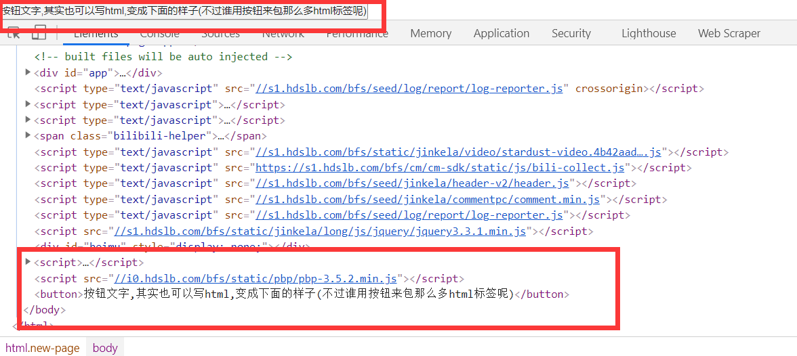

```mdx-code-block
import BrowserOnly from '@docusaurus/BrowserOnly';
import Admonition from '@theme/Admonition';
```

# 使用脚本向页面上添加新元素

使用脚本向前端页面插入元素，给 B站添加一个真 · 一键三连的按钮

有兴趣也可以写二连，太耗硬币了 T_T

:::warning

目前脚本已无法在B站上运行，

如果你有意愿更新本章可以联系指南维护人员进行协作更新。

:::

## 插入新元素

脚本往页面增加新元素这种需求经常可见，例如百度云的脚本，就会往页面上添加一些解析链接之类的按钮，一些助手类型的会往页面上添加一些小窗口，显示脚本的运行状态等等。

如果要让脚本往页面上添加新元素，原理很简单。

1. 首先使用 `document.createElement` 创建好你想插入的元素，例如按钮就 ` document.createElement("button")`，

2. 然后找到你想插入的位置，使用 `append/insertBefore`之类的方法插入你的 `element`。之后就可以在 `F12 开发者工具`中的 `element`中看到我们插入的内容了。

:::tip

如果你有很多组件想放进去的话可以用 `document.createElement("div")`，然后往 `element` 里的 `innerHTML` 直接写 `html` 代码。

例如：

```js
let div = document.createElement("div");
div.innerHTML = '<span>span1</span><span>span2</span>';
// 插入到页面的body中
document.body.append(div);
```

<Admonition type="info" icon="💡" title="试一试">
  <BrowserOnly>
      {()=>
      <>
        点击按钮后，使用 <code>F12</code> 审查元素：<button style={{margin:"1rem"}} onClick={
          function (){
            let div = document.createElement("div");
            div.innerHTML ="<span class='span-1'>span1</span><span class='span-2'>span2</span>";
            document.querySelector(`#div-1`).append(div);
          }
        }>生成</button>
        <div id="div-1" className="demo" style={{display:"flex","flex-wrap": "wrap"}}></div>
      </>
      }
  </BrowserOnly>

</Admonition>

:::

:::info

除了 [append](https://developer.mozilla.org/zh-CN/docs/Web/API/ParentNode/append)，类似的函数还有 [appendChild](https://developer.mozilla.org/zh-CN/docs/Web/API/Node/appendChild)，[prepend](https://developer.mozilla.org/zh-CN/docs/Web/API/ParentNode/prepend)，[insertBefore](https://developer.mozilla.org/zh-CN/docs/Web/API/Node/insertBefore)，

具体方法和区别可以自行百度搜索和查看文档

（其实是我嫌麻烦，整理一下又可以水一篇了）

:::

当然上述是的原生的方法，例如有些网页自带 `jQuery`，那么可以用 `$("html代码")` 之类的方式去创建元素，再用 `jQuery` 的 `append` 之类的方法插入到页面中去。

本系列内容还是使用原生的来进行讲解和使用。

## 新元素的事件监听

元素是添加进去了，但是只能看又不能用那有啥用，所以我们需要监听我们的元素事件。

最常用的就是 `click` 点击事件，点了我们的按钮，让我们的脚本做出一些反应。

### 单元素监听

如果是类似按钮的方式，我们可以这样写，直接的使用 `onclick` 的方法。

```js
let btn = document.createElement("button");
btn.innerHTML =
  "按钮文字，其实也可以写html，变成下面的样子(不过谁用按钮来包那么多html标签呢)";
//innerText也可以，区别是innerText不会解析html
btn.onclick = function () {
  alert("点击了按钮");
};
document.body.append(btn);
```

执行上面的代码，一个新的按钮被插入到了 body 的最后面。



### 多元素监听

如果是写在一个 `div` 中的多个元素，可以使用下面的方式处理多个元素的点击事件。

```js
let div = document.createElement("div");
div.innerHTML =
  '<span id="span-1">span1</span><span class="sp">span class</span>';
div.onclick = function (event) {
  if (event.target.id == "span-1") {
    alert("span-1被点击了");
  } else if (event.target.className == "sp") {
    alert("sp这一类被点了");
  }
};
document.body.append(div);
```
:::info

event 详细说明: [Event](https://developer.mozilla.org/zh-CN/docs/Web/API/Event)

:::

这两种监听方式的区别，简单来说就是前一种方法我们监听的**只有一个**元素，那我们就知道就点击事件只可能是对这一个元素的操作。

第二个例子中，因为其中包含了多个元素，我们就需要从 `event` 事件中找到实际被点击的元素（可以通过 `id` 或者 `class` 等去判断），来走我们的脚本执行流程。

### 监听器的绑定方式

另外再补充一下，上面的 `onclick` 可以改写成 `addEventListener("click")`，类似下面这样。

```js
div.addEventListener("click", function (ev) {
  console.log(ev);
});
```

主要区别是 `onclick` 只能绑定一个 `function`，`addEventListener` 可以绑定多个。

这又涉及了前端的内容，大家可以课后补习一下，可以看一下[addEventListener](https://developer.mozilla.org/zh-CN/docs/Web/API/EventTarget/addEventListener) 的说明。

当然，也还有其它的绑定事件的方法，这里就不一一列举了。

对于监听页面上已经有的按钮，推荐用 `addEventListener`，以防 `onclick` 将原来的按钮事件覆盖掉(如果按钮也是用 `onclick` 的话)，看情况而定。

:::tip

在监听事件最后 `return false;` 可以使事件不再向上传递。

(有点扯远了，就随口提一句 😂，补充一些脚本的开发小技巧，就像是补充内力一样，以防踩坑，万一遇到了呢，不可能所有的东西都是完全按照教程来的。有兴趣的可以课外去细究，也可以略过有个印象就好。)

:::

## 新元素的 style

为了好看或者放在网页中不突兀，我们可以加上网页自带的 class 或者自己写一些样式，类似下面这样:

```js
btn.className = "default-btn"; //添加class
btn.id = "submit-btn"; //添加id
btn.style.color = "#ff0000"; //给按钮写style样式，查看这个文档，看css与JavaScript的对应:https://developer.mozilla.org/en-US/docs/Web/CSS/CSS_Properties_Reference
div.innerHTML =
  '<span id="span-1" class="span-class" style="font-size:12px">span1</span><span class="sp" style="color:red">span class</span>'; //在html里写style
```

<Admonition type="info" icon="💡" title="试一试">

  在下面的例子中我使用了 `"#"+Math.random().toString(16).slice(2,8)` 生成随机颜色，每次点击按钮都会变成随机颜色。

  ```js
  function(){
    document.querySelector(`#demo-2`).style.color =
    "#"+Math.random().toString(16).slice(2,8);
  }
  ```
  <BrowserOnly>
      {()=>
      <>
        <span id="demo-2">点击按钮使我改成随机颜色：</span>
        <button style={{margin:"1rem"}} onClick={
          function(){
            document.querySelector(`#demo-2`).style.color="#"+Math.random().toString(16).slice(2,8);
          }
        }>修改颜色</button>
      </>
      }

  </BrowserOnly>

</Admonition>

## bilibili 真·一键三连

上面的内容说完后，来做点实际的东西。

我们希望在页面上的收藏按钮和分享按钮中间增加一个三连按钮


我们可以先通过 `F12` 开发者工具找到这一块的元素，发现是用的 `span`，为了样子一样我们可以用 `span` 来创建。不过为了方便，我们还是使用 `button`，大家也可以当作课后作业去完善。

(实际上也没什么图标，直接用按钮得了)


创建代码如下:

```js
let triple = document.createElement("button");
triple.innerText = "三连";
triple.style.background = "#757575"; //颜色弄得差不多吧
triple.style.color = "#fff";
triple.onclick = function () {
  //三连代码
};
```

插入我们可以找到 `share` 的父节点，这次我们使用 `insertBefore`，在 `share` 之前插入我们的三连按钮，代码如下:

```js
let share = document.querySelector(".share");
share.parentElement.insertBefore(triple, share);
```

emmmm 好丑，先这样吧，功能是可以的就行 😂


不过直接的这样插入是不行的，最终代码类似这样，比较复杂需要有点 `DOM` 之类的知识才好理解，暂时不展开吧，也暴力一点也可以直接用 `setTimeout` 等一段时间再插入，且 `run-at` 设置为 `document-end`。

```js
let ops = document.querySelector("#arc_toolbar_report .ops");
ops.addEventListener("DOMNodeInserted", function (event) {
  let share = document.querySelector(".share");
  share.parentElement.insertBefore(triple, share);
});
```

:::tip

插入三连之后好像会重新生成，不添加就不会重新生成，暂时没弄清什么情况，先这样处理了。

主要作用是监听 `ops` 的 `DOMNodeInserted` 事件，等它修改完成之后再插入我们的三连按钮，另外注意 `run-at` 是 `document-end`，要等待 `ops` 生成之后再监听，不然 `query` 返回 `null` 会报错

这个事件会多次调用，但是我们 `insertBefore` 插入如果元素存在，只是修改而不会新增

:::


然后我们可以长按大拇指，抓一下三连的 `http` 请求，就像上一节的 `ajax` 自动关注 up 主一样


`aid` 是我们的视频 `id`，`csrf` 的在 `cookie` 里面，这里就暂时不细说了，因为我们就是在 bilibili 的页面上，所以我们不需要使用 `GM` 跨域(所以我的 `grant` 是 `none`，不需要沙盒环境，另外用 `unsafeWindow` 也挺麻烦的)，而且也可以直接通过 `cookie` 取到 `csrf`，直接用 `xhr` 请求接口就行了。代码如下:

```js
let httpRequest = new XMLHttpRequest();
httpRequest.open('POST', 'https://api.bilibili.com/x/web-interface/archive/like/triple');
httpRequest.setRequestHeader("Content-type","application/x-www-form-urlencoded");
httpRequest.withCredentials = true;//设置跨域发送带上cookie
let aid=window.__INITIAL_STATE__.aid;
let sKey="bili_jct";
let csrf=decodeURIComponent(document.cookie.replace(new RegExp("(?:(?:^|.*;)\\s*" + encodeURIComponent(sKey).replace(/[-.+*]/g, "\\$&") + "\\s*\\=\\s*([^;]*).*$)|^.*$"), "$1")) || null;
//上面这一段就是取出csrf，在cookie里面是bili_jct，这一段我是直接copy的，总之获取到就好了啦
httpRequest.send('aid='+aid+'&csrf='+csrf);
httpRequest.onreadystatechange = function () {
    if (httpRequest.readyState == 4 && httpRequest.status == 200) {
        var json = JSON.parse(httpRequest.responseText);
        console.log(json);
        if(json.code==0){
           alert("三连成功!刷新页面可见");
        }else{
            alert("三连失败/(ㄒoㄒ)/~~");
        }
    }
};
```

上述取 `csrf` 代码来自: [Document.cookie](https://developer.mozilla.org/zh-CN/docs/Web/API/Document/cookie%E4%B8%80%E4%B8%AA%E5%B0%8F%E6%A1%86%E6%9E%B6%EF%BC%9A%E4%B8%80%E4%B8%AA%E5%AE%8C%E6%95%B4%E6%94%AF%E6%8C%81unicode%E7%9As%84cookie%E8%AF%BB%E5%8F%96%E5%86%99%E5%85%A5%E5%99%A8)

## 总结

我们脚本本次用了 `run-at`，`@grant none`，这是之前学习过的，大家可以多多注意一下。

[脚本安装地址](https://bbs.tampermonkey.net.cn/thread-238-1-1.html)