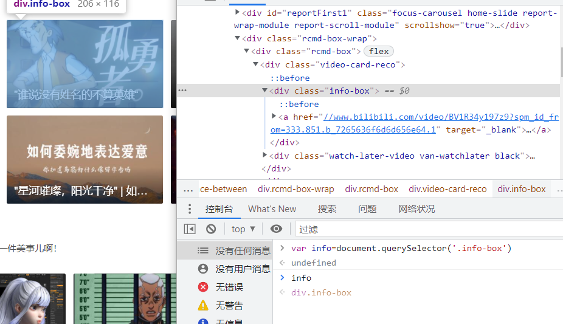
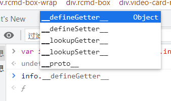
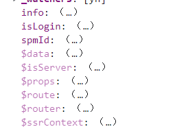
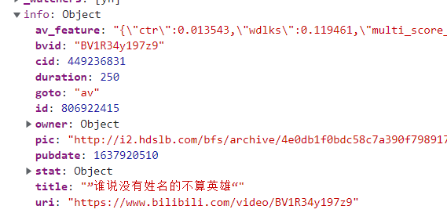
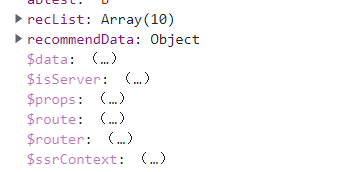
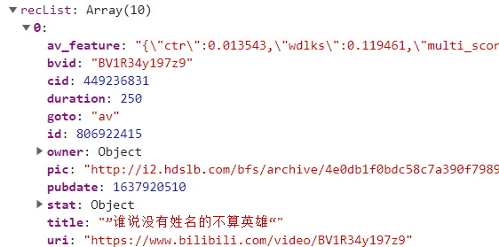

# Vue 初探与代码分析

:::note 联合作者：cxxjackie/李恒道

由于研究还不是特别深入，所以可能存在一些事实性的出入

以后会慢慢修改和补正

:::

:::danger 警告

关于对页面进行调试，强烈建议使用Chrome，经测试火狐浏览器显示数据不完整，其他浏览器情况未知

:::

## 正文

如果你存在输入后存在校验，自动清空，无法点击按钮等问题，可以去[元素规则校验和检测的触发](/油猴教程/中级篇/元素规则校验和检测的触发)寻找相关的处理方法，目前处理基本已经完善

## 基础概念

`Vue`在我们`new Vue`的时候会创建一个`Vue的实例`，实例根据我们的模板内容做解析，绘制虚拟 DOM，并渲染到页面上

同时每一个 Vue 组件也都是一个实例

那我们如何找到实例对象？

在一些元素上打印出`vue`属性即可

为什么存在 vue 属性这点可以在 vue 源码中的

```js
 Vue.prototype._update=function (vnode, hydrating) {
   ...
    if (vm.$el) {
      vm.$el.__vue__ = vm;
    }
   ...
}
```

这里可以看到了挂载`__vue__`属性为自身的 vue 实例

这里的$el 是根节点

如

```html
<div>
  <span>123</span>
</div>
```

这时候只有根节点 div 具有 vue 属性

## 如何查找 vue 属性

我们可以确定一个大概的范围，如果没有找到**vue**就通过该 DOM 元素的父或者子逐级排查。

一旦找到一个 vue 实例，即可通过`$parent`以及`$children`属性找到上下级的 vue 实例。

这里简单介绍一些属性


## 实战

以b站为例，我们目标是通过vue属性提取出来视频的基本数据

我们该怎么获取列表呢？

先以一个div为基准



我们先获取info-box的节点



发现不存在vue属性，接下来往上级或者下级找，因为我用的dom元素偏下，所以往上层找


可以发现看到了vue属性，接下来我们看这些数据，下边的那些数据通常我们不用太过于在意，但是最好也点开看一下

着重看深紫色的部分，因为`$`开头的基本都是组件携带的组件数据



经过翻找

我们可以看到info就是我们想看到的视频数据



那我们如果想获取一整个视频列表，我们应该怎么办呢？

就是找他的parent属性，然后再查看数据


我们可以找到



打开看一下，发现存在一个数组，每个数组都是一个视频数据




这个时候我们就可以提取数据做我们想要做的事情了！

或对其进行修改来达到显示我们想要的显示的东西，数据会自动进行触发响应

那么到这里我们就成功实现目标了！


