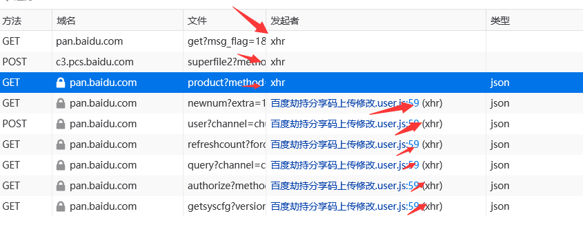

# 实战百度自定义分享码

简要：通过 XmlhttpRequest 监听修改提交内容劫持

知识学习：[XmlhttpRequest 提交劫持与内容监听](/油猴教程/入门篇/XHR提交劫持与内容监听/)

## 前提

首先我们需要先建立一个前提，修改提交内容必须后端没有对该内容进行过滤和校验，

如百度的分享密码，是由前端生成然后进行上传到后端，后端记录下来的。

如果是由后端返回一个分享密码并且禁止修改，那即使你在前端修改了显示，也是没有任何作用的，

最终的链接依然需要输入后端返回的密码。

那么我们开始实战。

## 查看 XHR 结构

首先我们看一下 `XHR` 的实现

```js
// 1. 创建 XHR 对象
var xhr = new XMLHttpRequest();
// 2. 调用 open 函数
xhr.open("POST", "http://www.xxx.com");
// 3. 调用 send 函数
xhr.send("a=1&b=2");
// 4. 监听 onreadystatechange 事件
xhr.onreadystatechange = function () {
  if (xhr.readyState === 4 && xhr.status === 200) {
    // 获取服务器响应的数据
    console.log(xhr.responseText);
  }
};
```

我们需要

1. 先创建 `XHR` 对象，
2. 然后 `open` 设置地址，
3. 之后 `send` 发送数据
4. 最后在 `onreadystatechange` 进行监听

如果我们想要修改提交的数据，那么自然而然应该劫持 `send` 函数

那我们先劫持掉 `send` 函数。

## 劫持实现

```js
let oldSend = XMLHttpRequest.prototype.send;
XMLHttpRequest.prototype.send = function () {
  console.log("send", arguments);
  return oldSend.apply(this, arguments);
};
```

通常，在我们运行劫持脚本后，在堆栈跟踪里看到了我们的脚本名字，就是代表已经成功劫持了。

如果发现没有成功劫持，可能是在脚本劫持之前已经被网页获取到了 `xhr`，

此时我们可以考虑使用 `// @run-at document-start` 抢先执行，试图比网页发送数据之前更快注入。


:::warning

判断一个请求是否是 xhr 需要看网络请求里的发起者部分。


:::

我们这里代码最核心的部分就是对提交的数据进行劫持，我们直接亮出来代码吧

```js
// arguments 是对 send 传入的参数，
// 我们首先判断长度是否为0，如果不为0就执行
if (arguments.length !== 0) {
  // 然后去判断是否不为空，因为我们属于侵入式脚本，
  // 需要尽量考虑到网页的各种可能存在的问题
  // 如果脚本劫持通信出现问题会导致无法正常浏览网页，所以一定要谨慎。
  // 判断是否存在indexOf函数则是接下来我们使用了indexOf函数
  // 他是一个属于字符串对象使用的函数，一些其他对象是不存在这个函数的
  // 所以我们最好对使用的函数进行判断。
  if (arguments[0] !== null && arguments[0].indexOf !== undefined) {
    // 如果判断存在 pwd 和 vcode，就执行下一步，
    // 这是我们在 f12 抓包的提交数据里看到的
    // 我挑了几个关键的字符进行判断，但是依然可能在其他功能上出现错误
    // 其实更好的办法可以通过 url 判断，这个我们接下来会处理。
    if (
      arguments[0].indexOf("pwd") !== -1 &&
      arguments[0].indexOf("vcode") === -1
    ) {
      //提示用户输入分享码，如果长度不为 4 或不输入默认 8888
      var number = prompt("输入默认修改的四位分享码，默认:8888", "8888");
      if (number.length !== 4) {
        number = "8888";
      }
      //这里我对提交的字符串使用了 replace，replace 是字符串的替换函数，
      // /pwd=[a-zA-Z0-9]{0,4}&/i 是什么意思？
      // 这个是一个正则表达式，因为不涉及教程的内容，所以我大概对这条进行讲解
      // 前后的/和/i 可以忽略，/i 是忽略大小写的意思，
      // pwd=和&都是一个固定的字符串，唯一变动搜索的就是[a-zA-Z0-9]{0,4}
      // []内表示搜索字符可以是括号内的任意一个字符,
      // A-Z 表示大写 A 到 Z，a-z 表示小写 a-z，0-9 表示数字 0-9
      // 说明我们匹配的字符可以是 A 到 Z，a-z，0-9 之中的任意一个字符，
      // 而{0,4}表示我们会匹配到 0 个到 4 个这样的字符
      // 最后将 pwd=[a-zA-Z0-9]{0,4}&匹配的内容替换成"pwd="+number+"&"
      // 这里非常简单，就是把默认的提取码替换成用户自定义的提取码
      // 并且提交就大功告成了。
      arguments[0] = arguments[0].replace(
        /pwd=[a-zA-Z0-9]{0,4}&/i,
        "pwd=" + number + "&"
      );
    }
  }
}
```

:::warning

接下来还会遇到一个问题，我们没有办法获取到 `url` 来判断到底应不应该劫持提取码，

因为 url 是在 `open` 的时候提交的，我们在 `send` 里只能看到提交数据，无法看到 `url`，

那我们应该怎么办呢？

我们可以考虑对 `open` 进行劫持，然后将 `url` 挂载到 `this` 上，

因为调用是 `xhr.open("POST", "http://www.xxx.com");`，

这个时候 `this` 就是 `new` 出来的 `xhr` 对象，

而 `send` 的 `this` 也是 `xhr` 对象，

那么我们就可以劫持 `open` 并且通过 `this._url = url;` 将路径写入到 `xhr` 对象上，

然后在 `send` 里做判断。
:::

```js
let oldOpen = XMLHttpRequest.prototype.open;
XMLHttpRequest.prototype.open = function (method, url, async, user, password) {
  this._url = url;
  return oldOpen.call(this, method, url, async, user, password);
};
```

在 `open` 中将 `url` 写入到了 `xhr` 中就大功告成了，

接下来我们在 `send` 里做判断，让我们看看完整代码

```js
let oldOpen = XMLHttpRequest.prototype.open;
XMLHttpRequest.prototype.open = function (method, url, async, user, password) {
  this._url = url;
  return oldOpen.call(this, method, url, async, user, password);
};
let oldSend = XMLHttpRequest.prototype.send;
XMLHttpRequest.prototype.send = function () {
  // 一些兼容性判断，防止不存在 _url 属性或该属性没有 indexOf 函数，
  // 如果都存在再判断是否是生成提取码的 url，然后判断参数
  if (
    this._url &&
    this._url.indexOf &&
    this._url.indexOf("/share/set?channel=") !== -1 &&
    arguments.length !== 0
  ) {
    if (arguments[0] !== null && arguments[0].indexOf !== undefined) {
      if (
        arguments[0].indexOf("pwd") !== -1 &&
        arguments[0].indexOf("vcode") === -1
      ) {
        var number = prompt("输入默认修改的四位分享码，默认:8888", "8888");
        if (number.length !== 4) {
          number = "8888";
        }
        arguments[0] = arguments[0].replace(
          /pwd=[a-zA-Z0-9]{0,4}&/i,
          "pwd=" + number + "&"
        );
      }
    }
  }
  return oldSend.apply(this, arguments);
};
```
