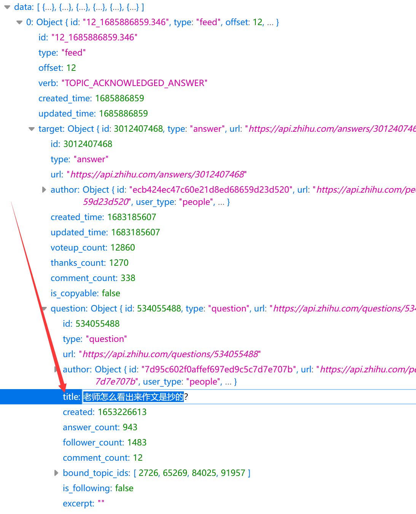
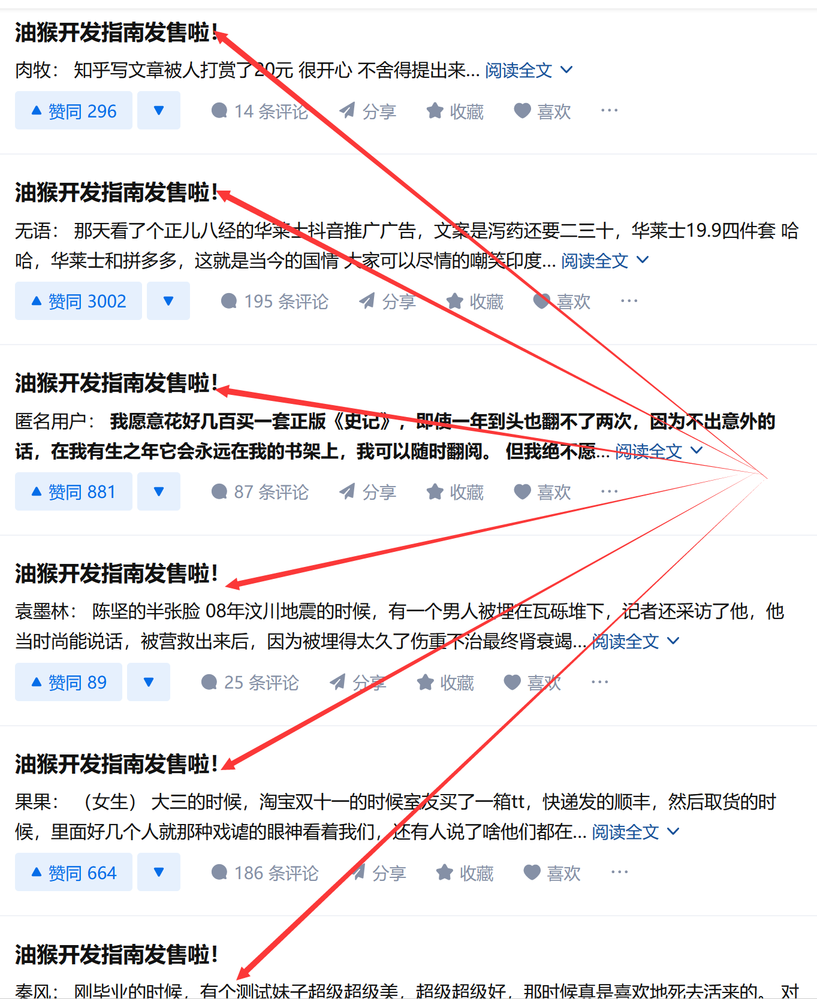

  ---
  sidebar_position: 3
  ---

  # 实战 Fetch 劫持知乎返回内容

  本节课我们将利用 Fetch 的劫持来控制返回内容

  ## 实战目标

  对知乎推荐的标题进行修改

  ## 操作过程

  通过抓包，我们可以看到获取刷新列表的 `api` 是


  ```
  https://www.zhihu.com/api/v3/feed/topstory/recommend?xxx
  ```


  所以可以先尝试一个 fetch 劫持

  ```js
  // ==UserScript==
  // @name         实战知乎劫持返回内容
  // @namespace    https://bbs.tampermonkey.net.cn/
  // @version      0.1.0
  // @description  try to take over the world!
  // @author       You
  // @match        https://www.zhihu.com/*
  // @run-at       document-start
  // @grant        none
  // ==/UserScript==
  let oldFetch = fetch;
  function hookFetch(...args) {
    return new Promise((resolve, reject) => {
      oldFetch.call(this, ...args).then((response) => {
        if (
          args.length !== 0 &&
          args[0].indexOf &&
          args[0].indexOf("/api/v3/feed/topstory/recommend") !== -1
        ) {
          const oldJson = response.json;
          response.json = function () {
            console.log("触发了json");
            return new Promise((resolve, reject) => {
              oldJson.apply(this, arguments).then((result) => {
                console.log("返回数据", result);
                resolve(result);
              });
            });
          };
        }
        resolve(response);
      });
    });
  }
  window.fetch = hookFetch;
  ```

  输出内容

  ```
  触发了json
  返回数据 Object { data: (6) […], paging: {…}, fresh_text: "推荐已更新" }
  ```

  为了展示如何劫持返回内容，我们简单尝试一下修改标题

  查看一下数据，发现 `data` 是推荐的每个文章

  其中 `target.question.title` 是文章的标题名

  

  所以可以直接在 `json` 后对数据进行修改，然后 `resolve` 返回，我们直接上代码

  注意这里我用的是 `forEach` 函数，是对 `Array` 数组进行循环，如果你不理解可以查阅MDN，与 `for` 进行循环处理一样

  ```js
  // ==UserScript==
  // @name         实战知乎劫持返回内容
  // @namespace    https://bbs.tampermonkey.net.cn/
  // @version      0.1.0
  // @description  try to take over the world!
  // @author       You
  // @match        https://www.zhihu.com/*
  // @run-at       document-start
  // @grant        none
  // ==/UserScript==
  let oldFetch = fetch;
  function hookFetch(...args) {
    return new Promise((resolve, reject) => {
      oldFetch.call(this, ...args).then((response) => {
        if (
          args.length !== 0 &&
          args[0].indexOf &&
          args[0].indexOf("/api/v3/feed/topstory/recommend") !== -1
        ) {
          const oldJson = response.json;
          response.json = function () {
            return new Promise((resolve, reject) => {
              oldJson.apply(this, arguments).then((result) => {
                // 在这里对json函数返回的数据进行修改，然后再resolve出去
                result.data.forEach((articleItem) => {
                  articleItem.target.question.title = "油猴开发指南发售啦！";
                });
                resolve(result);
              });
            });
          };
        }
        resolve(response);
      });
    });
  }
  window.fetch = hookFetch;
  ```

  发现已经劫持成功，那么就完成了对 Fetch 返回的数据进行修改。

  效果如图

  
