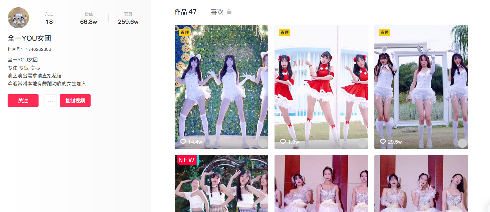
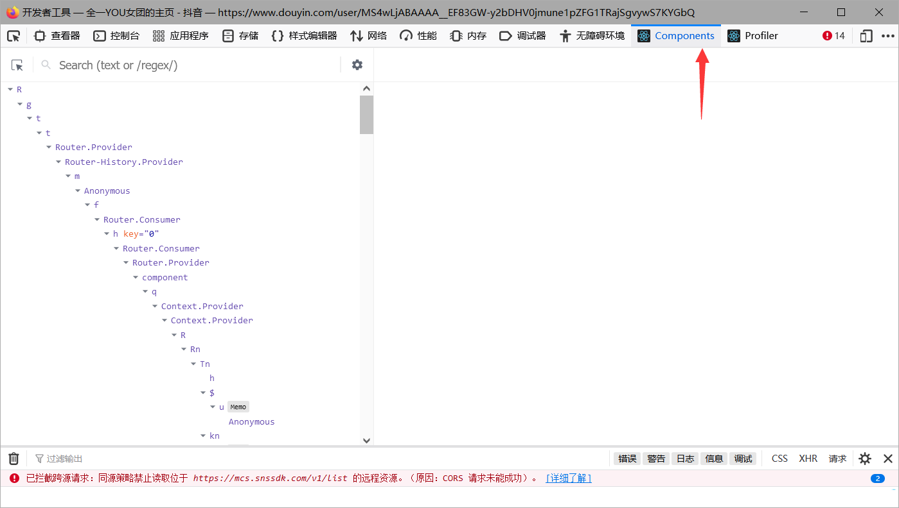
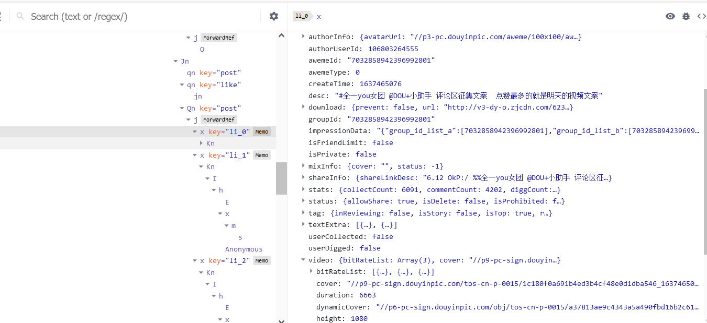
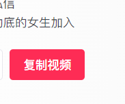
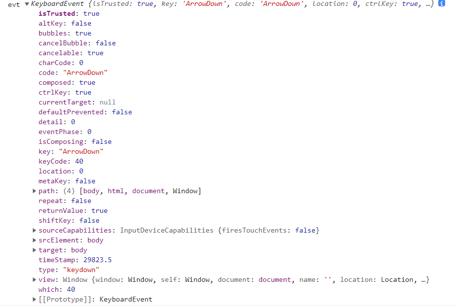
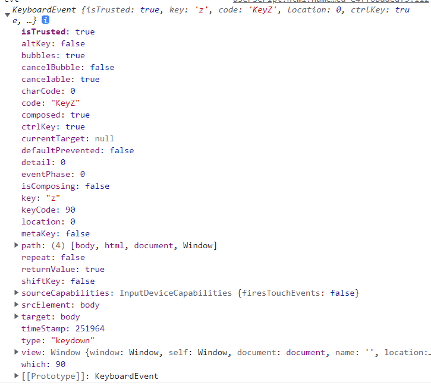

# 实战 React 数据提取抖音视频

:::tip 特别鸣谢

本文基于 cxxjackie 提供的理论，特此感谢
:::

之前我们已经在元素规则校验中研究过网页的校验如何解决，这节课我们可以实战一下提取 react 页面的数据

## 页面分析

以抖音的[全一 YOU 女团](https://www.douyin.com/user/MS4wLjABAAAA__EF83GW-y2bDHV0jmune1pZFG1TRajSgvywS7KYGbQ)页面为例，发现抖音是 react 页面



如何判断是 react 页面？我们可以安装 [`React Developer Tools`](https://react.dev/learn/react-developer-tools#browser-extension)，不同的显示如下，


|不是 react 页面|是 react 页面|
|---|---|
|||

确定是 react 页面后，我们可以点击这里



然后通过


选择到元素

:::warning

推荐选择到相应元素的最上级，然后一层一层往下或往下逐步查找相关的数据以及事件

:::

我们在这里找到了视频的信息



这时候我们就可以开始写代码了

首先他第一页是没有 `post` 的，属于网页渲染出来的数据，但是这时候也可以使用 `react` 属性提取地址，相对 `xhr` 劫持会好很多。

我们先获取第一页的内容，然后进行 `MutationObserve` 监听视频部分的绘制

所以抽离一个函数，专门用于处理视频，

我起名叫 `enableObserve`，负责将第一页的视频循环调用 `handleVideoItem` 函数，然后再通过 `MutationObserve` 函数监听接下来渲染的视频

```js
let videoData = new Map();
function handleVideoItem(item) {
  // 处理函数
}
function enableObserve() {
  const domSelector = ".UFuuTZ1P ul";
  document.querySelectorAll(domSelector + " li").forEach((item) => {
    handleVideoItem(item);
  });
  const targetNode = document.querySelector(domSelector);
  const config = {
    childList: true,
  };
  const callback = function (mutationsList, observer) {
    for (let mutation of mutationsList) {
      if (mutation.type === "childList") {
        mutation.addedNodes.forEach((item) => {
          handleVideoItem(item);
        });
      }
    }
  };
  const observer = new MutationObserver(callback);
  observer.observe(targetNode, config);
}
```

然后我们还需要插入一个按钮，用于提取数据



这里的 innerHTML 是直接改的网页按钮，然后复制粘贴的

```js
let parenttagert = document.querySelector(".Z0NF3RWY");
let div = document.createElement("div");
div.innerHTML = `<div class="q6zgm94p k-vFWw3W FDOWibym BgSUKoKp"><span class="_891e9d38c00e1b78e2eae43ab8b92359-scss" style="cursor: pointer;">复制视频</span><div class="_421d3aff42f03ac25665dc94de7ceadb-scss _6e84962fcb7da3b1e8100d798c94fd0a-scss" style="display: none;"><div class="a508b8e520c4938b699e76f52758e1b5-scss"><div class="f34e96e88162611d7208f348d4f89234-scss"></div></div><div class="c970dfb43b7e68344f353625de339de0-scss"><div class="_6ed090956a2566bf4d47a648b75d87ef-scss">打开抖音扫码或复制口令粘贴给微信/QQ好友</div><div class="_5d025eb178c1c97d99eb9717cb4f0290-scss"><span class="_95cfb8df7d5be42fc93f8f4464a1c648-scss">3.82 wfB:/ 这样子的小风车你们喜欢吗～%%夹子音 %%夹子音挑战 %%夹子音变装 @DOU+小助手 @抖音小助手  https://v.douyin.com/d1FgV77/ 复制此链接，打开Dou音搜索，直接观看视频！</span><button class="abace09bde29f9d2077ba2a9e9e2b67d-scss _3c25ad295260cb707e35da1ec8d93a51-scss _14339689bca6b9eda19c146a14df625e-scss _047cfcad258573fad8a7513577bb9f75-scss"><span>复制</span></button></div></div></div></div>`;
div.onclick = function (event) {
  let text = "";
  // videoData即是选中的视频，是一个Map类型
  for (var videoURL of videoData.values()) {
    text += videoURL + "\n";
  }
  GM_setClipboard(text);
  alert("已设置到剪辑版共" + videoData.size + "个");
};
parenttagert.append(div);
```

## 核心功能实现

接下来我们要开始写核心功能函数了

我对网页插入了一个单选框，这时候 `MutationObserve` 也会监听到，所以一旦检测到就不进行任何操作

创建单选框后，监听点击事件

一旦发生点击则直接根据 `react` 属性的 `children[0].props.aweInfo` 提取出来数据

最后保存到 `videoData` 的 `Map` 中去，最后点击复制按钮全部提取出来链接贴到剪辑版

```js
function handleVideoItem(item) {
  if (item.className.indexOf("injectvideo") != -1) {
    return;
  }
  item.classList.add("injectvideo");
  const selectDom = document.createElement("label");
  selectDom.className = "container control-pos";
  selectDom.innerHTML = ` <input  type="checkbox"><div class="checkmark"></div>`;
  selectDom.addEventListener("click", function (event) {
    if (selectDom.children[0].checked) {
      const prop = Object.keys(item).find((p) => p.startsWith("__reactProps"));
      if (prop === undefined) {
        return;
      }
      let info = item[prop].children[0].props.info;
      let videourl = info.video.playApi;
      videourl =
        "https://" +
        videourl
          .replace("https://", "")
          .replace("http://", "")
          .replace("//", "");
      videoData.set(selectDom, videourl);
    } else {
      videoData.delete(selectDom);
    }
  });
  item.append(selectDom);
}
```

那么到这里我们就学会了如何提取 react 数据来实现提取抖音视频~

## 改善用户体验

接下来我们可以继续完善一下脚本的体验，例如完善脚本的键盘事件

我们想完成两个目标：

1. 按键自动滚动到底部，并且返回到顶部
2. 按键自动全选所有视频，或取消所有视频

### 按钮事件框架

首先我们打算监听 `Ctrl + ↓` 以及 `Ctrl + Z` 这两个快捷键作为功能触发按键。

拦截按键的事件如下：

```js
unsafeWindow.addEventListener("keydown", (evt) => {
  console.log("evt", evt);
});
```

我们先打印一下看看

这里我选择在按下键的时候进行监听



这里着重注意的就是 `keyCode`，`ctrlKey`，`shiftKey`，`altKey`

`keyCode` 是我们按键的按键码，而 `ctrl`，`shift`，`alt`，那三个键值，代表你按键的时候是否按了对应的功能键

可以看到我按了 `Ctrl + ↓` 的时候 `ctrlKey` 值为 `true`，

然后是选择全部视频的按键，由于页面中 `Ctrl + A` 会选择页面全部文本，

所以这里我们临时更改为 `Ctrl + Z`

:::tip 想一想

如何阻止默认的按键事件呢？

<details>
<summary>查看答案</summary>

使用 [`event.preventDefault();`](https://developer.mozilla.org/zh-CN/docs/Web/API/Event/preventDefault) 方法阻止默认的按键事件
</details>

:::



可以看到键码为 `90`，所以这里我们可以写出按钮监听的框架了

```js
unsafeWindow.addEventListener("keydown", (evt) => {
  if (evt.ctrlKey) {
    if (evt.keyCode == 40) {
      //开始设置滚轴
      jumpToBottom();
    }
    if (evt.keyCode == 90) {
      //选择或取消全部视频
      selectAllVideo();
    }
  }
});
```

### 自动滚动功能实现

我们先写滚轴到下最后直接跳到顶部

我们直接先写一下滚轴代码吧

这里我用了 setinterval 循环，以及一个状态用来防止多次按键鼠标

```js
let bottomFlag = false;
function jumpToBottom() {
  if (bottomFlag == true) {
    return;
  }
  bottomFlag = true;
  let timer = setInterval(() => {
    let bottomdiv = document.querySelector(".knrjsN15 .VxGqO7jM");
    if (bottomdiv !== null) {
      if (bottomdiv.innerText === "暂时没有更多了") {
        unsafeWindow.scrollTo(0, 0);
        bottomFlag = false;
        clearInterval(timer);
        return;
      }
    }
    unsafeWindow.scrollTo(0, document.body.scrollHeight);
  }, 300);
}
```

### 全选功能实现

接下来我们来做选择全部的按键功能

我们直接获取视频数量，跟选中数量进行对比，然后判断选中全部还是取消全部

最后模拟用户的选择状态，触发脚本监听的 `onclick` 函数

代码如下

```js
function selectAllVideo() {
  let videoCheckList = document.querySelectorAll(".control-pos input");
  let willStatus = false;
  if (videoData.size === videoCheckList.length) {
    //取消全部
    willStatus = false;
  } else {
    //选择全部
    willStatus = true;
  }
  videoCheckList.forEach((item) => {
    item.checked = willStatus;
    item.parentElement.dispatchEvent(new Event("click"));
  });
}
```

那么到这里抖音视频脚本就宣告完结了！
