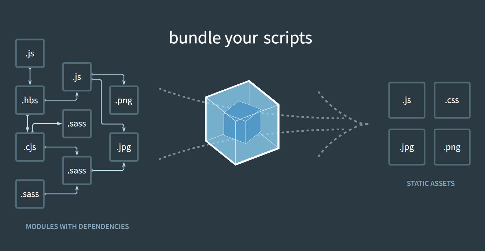

# webpack简介

在今后的日子里，我们会逐渐带领大家尝试搭建出一个webpack的脚手架编译油猴脚本的代码

也会逐步掺杂一些其他更有趣的东西，来努力实现真正的工程化。

## webpack初探

webpack是什么？

我们可以看一下官网的图片，[webpack官网](https://webpack.js.org/)




其本质就是打包js代码以及做更多的处理。

如果没有进入工程化的时候，我们只能在一个js中写大量的代码，这样是很不利于日常的开发以及维护。

我们也可以拆分成多个js文件，但是这样又会存在引入问题，冲突问题等等。那我们应该把js代码拆分成模块？

社区出现了多种多样的模块化方案，如：AMD、CMD、CommonJS、ES6。但是目前AMD和CMD都已经基本进入历史的洪流了，所以我们目前只需要了解CommonJS以及ES6的模块化方案即可。

但是现在又出现了新的问题，第一是浏览器并没办法兼容一些模块化方案，第二是即使兼容模块化方案也可能因为模块化而加载大量的碎片文件、造成严重耗时。同时如果对文件进行压缩等处理也需要借助其他工具，太麻烦了！

那我们应该怎么解决呢？

解决方案就是我们应该尝试搞出来一个模块的打包工具，这种工具可以将模块化的文件在部署到正式环境的时候全部压缩成一个文件(也可能是多个)。

这就是webpack的最本质的工作！我们可以从官方找到这句话

```
webpack is a static module bundler for modern JavaScript applications.
webpack是一个现代JavaScript引用的静态模块打包工具
```

那除此之外、既然我们已经负责了代码的合并工作，我们就必然需要对代码进行读取和解析。

那为什么我们不做更多工作？比如对编译后的代码进行代码压缩，在编译的过程中可以根据编译的浏览器目标做对应的语法降级(使用插件)，根据编译的不同配置来区分环境，编译出不同的代码内容，通过附加插件来让webpack编译更多的代码/解析更多的东西等等一些列的辅助工作。

而Webpack统统可以！哇哦，这太棒了！我们甚至可以通过编写webpack代码插件来让其处理我们自己的一套解析规则！

但是Webpack的工作远不止于次，在今后的使用中你会赞叹出一句Awesome！

那就在接下来的日子里让我们一起研究webpack吧！
 
