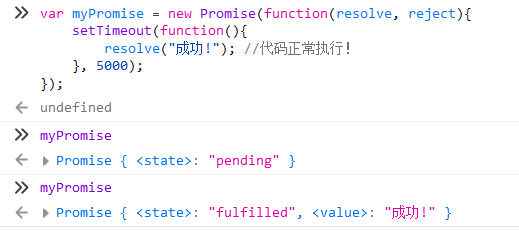

# Promise 基础

在本章中你将学会有关于 Promise 的基础语法

# 正文

Promise 代表了未来发生的事件，相当于我与你签订了一个协议，我们现在协议没有办法完成，而在未来的某个时间点，这个协议会由执行中变为履行或者未履行

```js
var myPromise = new Promise(function (resolve, reject) {
  setTimeout(function () {
    resolve("成功!"); //代码正常执行！
  }, 5000);
});
```



我们创建 Promise 的时候是在 new Promise 的过程中传入一个函数，Promise 会调用这个函数，并且传给我们两个参数

resolve 以及 reject，如果你这个函数最后执行成功了，调用 resolve 并且传入数据，Promise 将会变得已履行状态，如果调用 reject，则是表示履行失败的状态

在代码中可以看到，当履行的过程中会显示 pending，而当履行完毕后会显示 fulfilled(履行完毕)

但是在这时候我们是拿不到 Promise 的值的，我们该怎么样才能拿到呢？即对 Promise 后添加一个 then 函数，当 Promise 变为完毕的状态后即会自动调用我们的 then 函数并且传入数据。

```js
var myPromise = new Promise(function (resolve, reject) {
  setTimeout(function () {
    resolve("成功!");
  }, 5000);
});
myPromise.then(function (data) {
  console.log(data); //打印【成功!】
  return data + " 已被then处理";
});
```

当上部分函数调用了 resolve 后，将会调用挂载到 Promise 上的 then 函数，并将 resolve 内的参数传入

这里我通过 console.log(data)输出了我们获取到的内容，那大家可能会疑惑，为什么我又 return 了一个`data + " 已被then处理"`;

因为 new Promise 产生的是一个 Promise 对象，而我们对这个对象挂了 then 后，then 也会返回一个 Promise 对象，这样方便我们对数据进行一层一层的处理或者包装。

```js
var myPromise = new Promise(function (resolve, reject) {
  setTimeout(function () {
    resolve("成功!");
  }, 5000);
});
var myPromise2 = myPromise.then(function (data) {
  console.log(data); //打印【成功!】
  return data + "已被then处理";
});
myPromise2.then(function (data) {
  console.log(data); //打印【成功! 已被then处理】
});
```

我们挂载了两个 then

第一个 then 获取到了 Promise 的数据，然后对其进行输出并处理，返回了`data + " 已被then处理"`交给了第二个 then，第二个 then 是我们最终处理的数据的函数

我们直接输出内容，这个 Promise 就宣布完成！

需要注意的是第二个 then(指代`myPromise2.then`)也会返回一个 Promise，由于我们没有给他返回值，所以是履行状态，返回的值 value 是一个 undefined


在 then 函数中我们也可以返回一个 Promise

如果返回普通内容，普通内容将会变成 then 返回的这个 Promise 的 value 值，并且状态默认为fulfilled

如果返回一个 Promise，那该then函数的状态将直接变成我们返回的Promise的状态

```js
new Promise(function (resolve, reject) {
  setTimeout(function () {
    resolve("执行任务完成");
  }, 5000);
})
  .then(function (data) {
    //打印内容：【我是then，我获取了数据，进行处理:  执行任务完成】
    console.log("我是then，我获取了数据，进行处理:  " + data);
    return new Promise(function (resolve, reject) {
      setTimeout(function () {
        resolve("二次任务完成"); //代码正常执行！
      }, 1000);
    });
  })
  .then(function (data2) {
    //打印内容：【then获取了数据，并进行处理，然后获取了新的数据丢给我:  二次任务完成】
    console.log(
      "then获取了数据，并进行处理，然后获取了新的数据丢给我:  " + data2
    );
  });
```

我们可以看到，在第一个 then 中我们创建了一个 Promise 并且返回，当这个 Promise 结束后，会调用第二个 then，并传入数据。

那这里 Promise 的大概概念大家已经理解了

那还有最后一个问题，如果我们的 Promise 没有完成怎么办？

我们就需要调用 reject 表示未履行

```js
var promise = new Promise(function (resolve, reject) {
  setTimeout(function () {
    resolve("执行任务完成"); //执行了
  }, 5000);
});
var then1 = promise.then(function (data) {
  console.log("我是then，我获取了数据，进行处理:  " + data); //执行了
  return new Promise(function (resolve, reject) {
    setTimeout(function () {
      reject("二次执行任务失败"); //触发一个未履行的Promise
    }, 000);
  });
});
var then2 = then1.then(function (data2) {
  console.log("then获取了数据，并进行处理，然后获取了新的数据丢给我:  "+ data2); //因为未履行，所以then无法执行
});
var then3Catch = then2.catch((err) => console.log("捕获到了异常", err)); //因为未履行，所以触发了异常捕获
console.log(promise, then1, then2, then3Catch);
//输出内容
//我是then，我获取了数据，进行处理:  执行任务完成
//捕获到了异常 二次执行任务失败
```

如果我们对Promise挂载一个catch，当出现未履行的情况就会直接调用catch

```js
console.log(promise, then1, then2, then3Catch);
// promise
// Promise { <state>: "fulfilled", <value>: "执行任务完成" }
 
// then1
// then1 Promise { <state>: "rejected", <reason>: "二次执行任务失败" }

// then2
// then2 Promise { <state>: "rejected", <reason>: "二次执行任务失败" }

// then3Catch
// then3Catch Promise { <state>: "fulfilled", <value>: undefined }
```

这里我们可以看到，当我们在then1里调用了reject，导致then1的对象是未履行的状态，然后状态会传给then2，而then2因为then1的reject也无法履行，继续往下传递，这时候发现了then2身上挂载了一个catch，当发生reject的时候就会调用catch，所以会调用到then2后续的的catch函数，也就是说catch捕获了异常，在reject的过程中会使then的状态传递的，直至遇见catch或完成，最后输出的一个Promise是fufilled，因为他是捕获异常，我们在这里并没有搞出来新的异常，所以catch这个Promise是完成任务的！

### 补充

我们还可以添加一个finally，finally的函数不管成功还是失败最后一定会调用finally内的函数


