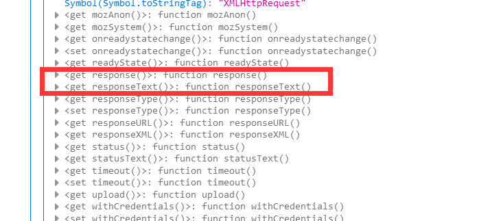

# XmlhttpRequest 返回内容劫持

本章中我们将学习到如何对 xhr 返回的内容进行劫持。

关于代码来源为 cxxjackie 大佬所作，[跳转地址](https://bbs.tampermonkey.net.cn/thread-1062-1-1.html)

本章仅进行代码的分析和学习

# 正文

我们先输出一下 xhr ,可以看到 xhr 的 response 和 responseText 等在原型链 prototype 上


这两个属性都是只有 get 没有 set，代表我们只可以获取他而不可以设置他的内容



所以我们书写代码如下

```js
//首先我们对xhr的open函数进行劫持，需要获取原open函数
//open是初始化xhr的内容，send是发送数据
//这里我们在初始化内容的时候进行劫持。
//我们其实可以在任何一个我们满足劫持需求的地方进行劫持
const xhrOpen = XMLHttpRequest.prototype.open;
XMLHttpRequest.prototype.open = function () {
  //这里保存了this到xhr变量，为了提高代码的可读性
  const xhr = this;
  if (arguments[1] == "xxxxx") {
    //获取response的操作符，如果你想要劫持responseText就需要改为responseText
    //getOwnPropertyDescriptor获取的是一个对象上属性的相关的描述符
    //可以拿到get，set，enumerable，configurable等。
    const getter = Object.getOwnPropertyDescriptor(
      XMLHttpRequest.prototype,
      "response"
    ).get;
    //这里对xhr的response属性做了一个defineProperty
    //当触发xhr.response的时候会访问对应的get
    //而get调用我们之前获取的getter函数，需要注意修改this指向
    //获取原返回内容，进行一定的修改，返回新的修改内容
    Object.defineProperty(xhr, "response", {
      get: () => {
        let result = getter.call(xhr);
        return result + " hook";
      },
    });
  }
  return xhrOpen.apply(xhr, arguments);
};
```

## 为什么设置到xhr上而不是xhr的原型链上

因为这样可以形成对某一个xhr进行劫持，如果设置到原型链上相当于对所有的xhr进行了一次劫持，如果你的劫持get内有大量的回调代码会严重拖慢运行的速度，并且response以及responseText只有get函数而没有set函数，是不允许重定义的。

## 为什么我没有对原型链的response进行劫持，却成功劫持了？

因为查找response的属性的时候是按顺序查找的，首先在xhr上查找是否有response，然后在xhr的proto也就是构造函数的prototype上查找response属性，如果找不到就一层一层往上找，这里我们进行了劫持之后会直接在xhr自身找到，甚至不会找到xhr的proto上的response，所以实现了劫持的操作。

## 为什么我无法进行劫持

可能网页使用了fetch通信，或注入时机过晚
