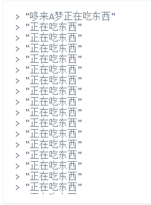

# 箭头函数

如果你在之前已经基本了解了 this 的大概含义，那么你理解箭头函数就很容易了！箭头函数是 ES6 标准中的一个新特性，与普通函数相比没有什么太大区别，唯一比较重要的就是 this 作用域的表现不同

# ES6 是什么

ES6 是 ECMAScript 6 的简称，那他跟 JavaScript 是什么关系呢？JavaScript 语言是 ECMAScript 6 标准的实现，而 ECMAScript 6 是 JavaScript 的标准，之所以不叫 JavaScript 其一是因为版权问题，其二是标准制定者是 ECMA(老子搞的凭什么算在 JavaScript 头上，笑:)

# 箭头函数的使用

使用还是比较简单的`()=>{}`不需要携带 function，只需要写出这样一个简单的格式即可产生一个箭头函数

举个小小的例子

```js
let funA = (str) => {
  console.log(str.length);
};
funA("88888"); //输出字符串长度5
```

这里大家就了解了箭头函数的使用了！

# 与普通函数的区别

普通函数的 this 通常取决于调用者或运行环境，而箭头函数的 this 取决于声明箭头函数的位置的所处作用域

为什么要这样做呢？

我们可以从一个小例子中看出来一些端倪

```js
var cat = {
  name: "哆来A梦",
  eat: function () {
    console.log(this.name + "正在吃东西");
  },
};
cat.eat();
```

搞一个小猫吃东西，不过分吧？那我想每隔三秒吃一次呢？加个 setInterval！

```js
var cat = {
  name: "哆来A梦",
  eat: function () {
    console.log(this.name + "正在吃东西");
  },
};
cat.eat();
setInterval(cat.eat, 3000);
```



这个时候并没有符合我们预期，除了我们自己调用的 eat 有名字，使用定时器获取不到 this.name 了，这是为什么？

因为我们把 cat.eat 函数传入给了 setInterval 定时器，定时器在调用函数的时候其作用域并不属于 cat,而是 window,因为定时器获取的是函数的引用，并且定时器属于 window 的函数，所以传入的 this 变成了 window

难道希望就要就此破灭了么？不，箭头函数是永远的神！

```js
var cat = {
  name: "哆来A梦",
  eat: function () {
    return () => {
      console.log(this.name + "正在吃东西");
    };
  },
};
setInterval(cat.eat(), 3000);
```

假如我们在 eat 函数在调用的时返回一个箭头函数，并且在 setInterval 使用这个箭头函数，就可以正常的输出内容

为什么这个却可以？

因为箭头函数获取的作用域是在创建箭头函数时候的作用域，也就是 cat 对象的 this，所以即使使用 setInterval 依然不会影响箭头函数的 this，这种特性叫做静态作用域。

那我们为什么不直接写成

```js
var cat = {
  name: "哆来A梦",
  eat: () => {
    console.log(this.name + "正在吃东西");
  },
};
setInterval(cat.eat, 3000);
```

反而要在多一层 function 呢？

因为箭头函数会获取到所处对象的所在的作用域，也就是 windows，那 this.name 就变成了获取 window 下的 name 变量内容了，所以我们才需要使用一层 function 来保留住箭头函数所处的作用域，这点大家刚开始接触可能难以适应，不如我们简化一下:箭头函数会继承 function 的 this 作用域，大部分的时候理解都不会出现太大的问题，如果出现超出你意外的情况就请查阅资料啦！

# 补充

当然，你也可以在 setInterval 的时候传入一个箭头函数，如

```js
var cat = {
  name: "哆来A梦",
  eat: function () {
    console.log(this.name + "正在吃东西");
  },
};
setInterval(() => {
  cat.eat();
}, 3000);
```

之所以举出返回一个函数的例子是为了让大家更直观的感受到箭头函数的this问题。