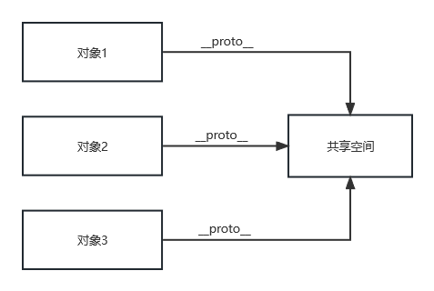
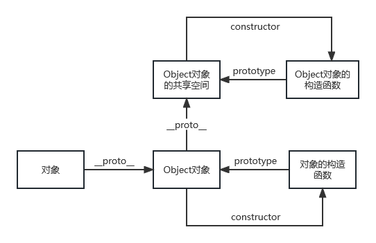
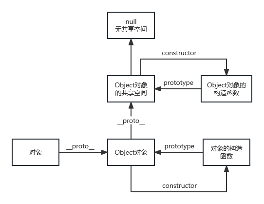
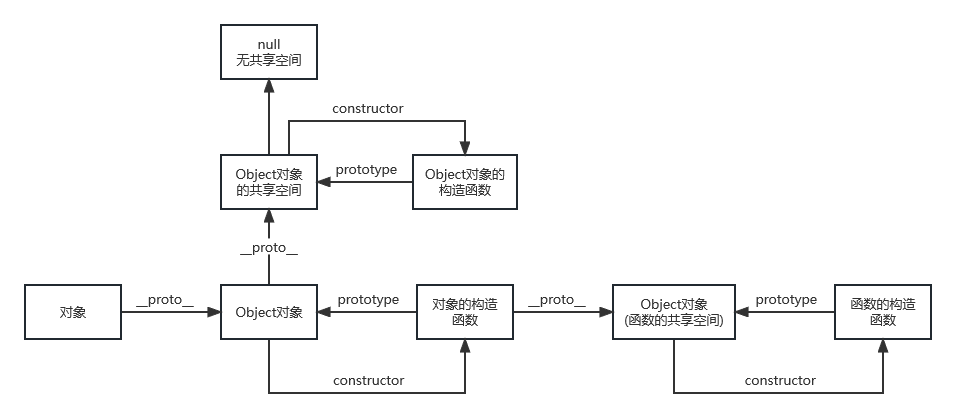
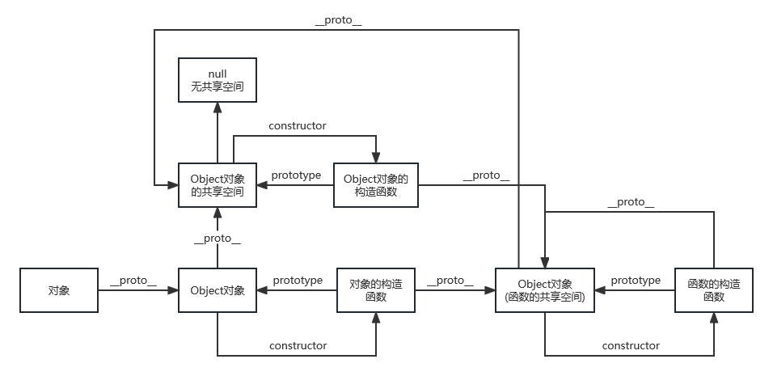

# 原型与原型链

在本章节你将从头对原型与原型链的概念进行推导来得出JavaScript原型链的概念图。

# new与函数this

在之前我们已经学习了this，在这节课我们研究JS中极其复杂的概念，原型与原型链

首先我们提出一个问题，假如我想创建上百个对象，我们该怎么做？

```js
function createObeject(name){
    var retobk={}
    retobk.name=name
    retobk.eat=function(){
        console.log(this.name+'吃东西')
    }
    return retobk
}
var a=createObeject('多来CC梦')
var b=createObeject('多来DD梦')
a.eat()
b.eat()
```
我们可以考虑搞一个函数，这个函数负责返回一个对象内容，但是这样很麻烦，而且并不直观，不够简洁漂亮，让我们来看看更简洁的写法！

```js
function createObeject(name){
    this.name=name
    this.eat=function(){
        console.log(this.name+'吃东西')
    }
}
var a=new createObeject('多来CC梦')
var b=new createObeject('多来DD梦')
a.eat()
b.eat()
```

我们把函数内的变量取消了，所有的数据都存到了this上，但是这个时候大家可能有疑问，这个this是什么？这个函数里的this需要与new进行联合使用，当我们调用new createObeject的时候，new就会自动创建一个对象，并且将this绑定到对象身上来完成接下来的赋值。

# 简化对象函数

其实尽管上面的我们可以使用，但是依然存在一个巨大的问题，就是这个函数是属于对象自身的，创建一个两个还好，但是如果我们重复创建上万个同样的对象，这同样的对象里包含了同样的一个重复的函数，这样实在太占用空间了。

那我们有什么解决的措施？我们可以对所有函数new出来的对象分配出一个相同的空间，让这个空间来存放一些相同的函数以及数据，用来节省空间。

这个空间的名字就是__proto__(原型)



那做到这里我们的问题已经解决一大步了，接下来我们继续推演，现在对象有共享的空间了，那我们在创建函数的时候，也要可以触及到共享的空间，这样才能使我们在写创建对象的函数代码的时候，把我们的一些函数放到共享的空间里。所以函数里存在一个prototype，用来指向共享空间。


那还有一个问题就是，我们该怎么知道哪个对象是由哪个函数构造出来的？我们可以给对象包含一个数据，这个数据指向函数，但是如果构造成千上万个对象，又包含成千上万个数据！太麻烦了，所以我们把这个引用也放到共享空间上。


那么到这里，你大概理解了一个函数的原型，让我们来继续进一步推导

JS有一个很有趣的地方就是，万物皆对象，就是一切都是一个对象类型

我们的共享空间以及函数也不例外

我们分别来观察共享空间以及函数吧

首先让我们看看共享空间

共享空间也是一个Object类型的对象，所以根据我们上述的

共享空间也具有__proto__，constructor以及prototype不过分吧



现在的图就变成了这样，共享空间作为一个对象也具有一个共享空间，也具有构造函数。

因为共享空间是一个Object对象，所以他的构造函数就是Object的构造函数，而他的共享空间也自然是Object对象的共享空间了。并且因为这里的Object对象的共享空间依然是一个Object对象，如果继续往上就形成了无限套娃，所以JavaScript在这方面的处理是将Object对象的共享空间再往上一层的共享空间直接设为null。



这里共享空间对象的这部分就算讲述完毕了，接下来我们再回头看看函数的脉络

由于JS万物皆对象的概念，函数也是一个对象，那他也应该具备共享空间，

那他也应该具有构造函数，他的构造函数是什么呢？因为他是一个函数类型，所以构造他的就应该是一个Function



因为函数的共享空间是一个Object对象，所以同上，依然跟对象的共享空间共享一个`Object对象的共享空间`


函数的构造函数是一个function Function，所有的函数都指向一个函数的共享空间，所以这里`函数的构造函数`的共享空间又指回了函数的共享空间


而之前构造共享空间的函数function Object也是一个函数，也要指向函数的共享空间



这里可以基本看到，不管从任何一个路径走，最后都会走到`Object对象的共享空间上`，而它也是一个对象，这也是JavaScript万物皆对象的由来。

这里原型和原型链的概念就推导完毕了，最后我们可以看一下网络上一张较为清晰的图

