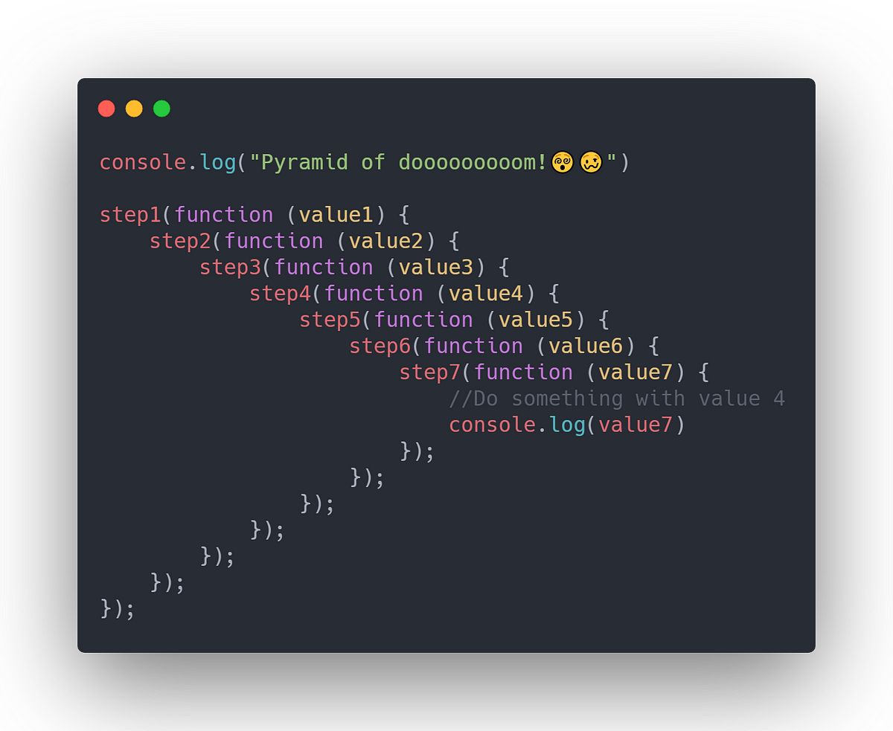

# 为什么需要 Promise

在本章将逐渐带领你推导为什么在代码开发的过程中需要使用 Promise。

作者 : 李恒道 / cxxjackie

# 正文

假设我们有一个函数，这个函数存在一些异步的操作

```js
function sleep() {
  setTimeout(() => {
    console.log("我执行完毕了");
  }, 3000);
}
```

我们想要执行 sleep 休眠到 3s 后再执行下一个函数

这个时候如果直接

```js
sleep(3000);
next();
```

是行不通的，因为 sleep 是一个异步函数，执行到 next 的时候 console.log 还没有执行

那怎么办？

因为 JS 里函数是一等公民(可以作为函数参数，可以作为函数返回值，也可以赋值给变量。)

所以我们可以把函数传递给 sleep 函数，让他在执行 3s 后再执行传入的函数

```js
function sleep(callback) {
  setTimeout(() => {
    callback();
  }, 3000);
}
console.log("我执行了");
sleep(() => {
  console.log("我等待了3s");
});
```

到这里一切都还很正常，但是假设我们的层级多了

```js
function sleep(callback) {
  setTimeout(() => {
    callback();
  }, 3000);
}
console.log("“执行了");
sleep(() => {
  console.log("我等待了3s");
  sleep(() => {
    console.log("我等待了6s");
    sleep(() => {
      console.log("我等待了9s");
      sleep(() => {
        console.log("我等待了12s");
      });
    });
  });
});
```

就出现了回调地狱，代码的长度并没有增加，而全部曲折在了一个函数内不断增加宽度。

这种代码也被戏称为厄运金字塔



但是如果我们抽象一下逻辑，发现虽然是回调地狱，实际执行流程是线性的

A-》B-》C-》D

所以我们可以创造一个对象，这个对象来负责管理异步函数，当异步函数执行完毕后执行回调，回调触发这个对象的下一步操作

伪代码大概是这样的

```js
wrapfunc((callback) => {
  setTimeout(() => {
    callback(1);
  }, 3000);
})
  .next((ret) => {
    console.log(ret); //1
    return ret + 1;
  })
  .next((ret) => {
    console.log(ret); //2
    return ret + 1;
  });
```

其实早在很久之前就出现了这种理念，并且称之 Promise

所以各语言以及实现的关键字相对一致

js 也出现了许多抽象该逻辑的代码库，因为非官方，所以我们通常称之为 Like Promise，如

bluebird http://bluebirdjs.com/docs/getting-started.html

promises/A+ https://promisesaplus.com/

jquery https://api.jquery.com/promise/

注意，这个时候已经基本出现了流的概念。

即将代码的执行流程视为一条信息的河流

A-》B-》C-》D

后来官方也实现了 promise 特性，让我们用 Promise 来实现一下例子！

```js
function sleep() {
  return new Promise((resolve) => setTimeout(resolve, 3000));
}
console.log("我执行了");
sleep()
  .then(() => {
    console.log("我等待了3s");
    return sleep();
  })
  .then(() => {
    console.log("我等待了6s");
    return sleep();
  })
  .then(() => {
    console.log("我等待了9s");
    return sleep();
  });
```

到这里相当于将 callback 进行了一次解耦

把相同的逻辑给聚合到了一个函数中方便复用以及关注点聚合到了一起

# Promise 改变了回调函数的什么

Promise 更大的意义在于，他可以处理一些“不确定性”问题，比如我们想在页面 load 以后执行代码，但不确定目前是否已加载完成

```js
if (document.readyState === "complete") {
  runScript();
} else {
  window.addEventListener("load", runScript);
}
```

如果我们还需要判断更多的不确定性，如不确定视频是否加载完毕，我们就需要再搞出一个函数用来判断视频是否完成，等等，多个判断被分割到了不同的函数中，一种自然而然的想法就是，将代码封装：

```js
function waitForLoad(next) {
  if (document.readyState === "complete") {
    next();
  } else {
    window.addEventListener("load", next);
  }
}
function waitForVideo(next) {
  //省略
  next();
}
waitForLoad(() => {
  waitForVideo(() => {
    console.log("i am run");
  });
});
```

假设我们将每个函数的检测都视为一个任务节点，那么传统的回调各自相互包含的，我们认为函数 A 包含函数 B，而函数 B 包含函数 C

明明同样是检测，只是检测不同的东西，在逻辑上应该是属于一个贯通的，但是代码上却互相包含看起来是十分别扭的

因为面向过程的编程语言通常天生就有顺序性，后一句代码在前一句之后执行，这是自然而然的想法，而回调写法打破了这种理解

但如果我们用 Promise 封装后，再使用 then 函数的写法会更加直观

```js
waitForLoad()
    .then(...)
    .then(...)
```

这个时候函数直接的视觉上的逻辑是一个平级的，函数 A 后调用 B，函数 B 调用函数 C，每个都是相互独立并且逻辑上是贯通的，这就是 Promise 的意义，也是异步编程的意义，原本割裂的代码得以组合到一起，本质是一种编程思想上的转变。

但是 Promise 的 then 的写法本身也是一种回调，并不能规避回调地域

只是将厄运金字塔的结构理成了一个流型结构，依然存在回调，这个我们放到后面 async 部分来解决。

# Promise 总结

Promise 的实现相当于一种依赖反转

即从我们来控制函数的回调变成了我们传入函数和回调

由 Promise 这个函数来进行控制何时进行回调

记住这个感觉！

现在我们总结一下

1.Promise 通过将异步函数包裹实现了将嵌套的异步逻辑变成了一个由上到下的各自独立的异步逻辑

2.Promise 符合依赖倒置思想，由我们控制回调，变成了我们传入异步函数和回调函数，Promise 来控制回调

3.Promise 符合流的概念(即按顺序执行代码块，如 A-》B-》C-》D)

相信到这里你已经理解到 1 和 3

我们继续基于 2 进行推导

既然是由 Promise 函数来控制回调，那是不是代表我可以添加更多的回调条件，如

传入一个列表，列表全部的函数完成才回调

第一个函数完成就回调

所以原生统计了一些常见的需求，出现了

Promise.all 全部成功回调

Promise.race 第一个成功就回调等需求

当然，只要你想，你可以自己实现一个类似 Promise 的库

必须 N 个失败 Y 个成功才可以开始执行回调~

# 为什么引入 async

如果我们函数需要返回一个 promise，我们要得到一个结果

我们就需要不停的创建 Promise 以及回调，然后返回，再在下方创建一个新的回调

本质上来说相当于一个流式的回调地狱

于是为了解决这种繁琐的声明

出现了 async 和 await

在 async 函数内可以直接对 promise 进行阻塞，这样就可以得到一个干净整洁的代码了~

```js
(async function () {
  await sleep();
  await sleep();
})();
```

到这里才是真正展平了回调地狱

### 一些小补充

当声明了一个 async 表明是异步函数

在异步函数使用 await 可以对一个 promise 在当前函数进行阻塞

同时返回也变成了一个 promise，代表这个异步函数的结果

因为返回变成了 promise

自然 async 糖也就具有污染性了

另外当使用 await 的时候如果 promise 出现 reject，我们必须使用 try-catch 进行捕捉

当然如果大量代码都需要可以使用 babel/webpack 插件处理

# 下一代的异步工具库

这里我个人比较看好 Rxjs

Rxjs基本继承了流的概念，同时包含了响应式编程以及函数式编程

算是很符合当下热潮的一个库

如我们注册一个事件监听器

```js
document.addEventListener("click", () => console.log("Clicked!"));
```

在 rxjs 将视为一个流的对象，这个流不断地传出事件触发订阅

```js
import { fromEvent } from "rxjs";

fromEvent(document, "click").subscribe(() => console.log("Clicked!"));
```

# 引用文档

https://stackoverflow.com/questions/43712705/why-does-typescript-use-like-types
http://bluebirdjs.com/docs/why-promises.html

https://medium.com/dsc-srm/javascript-callback-hell-or-pyramid-of-doom-4f786d14b997
